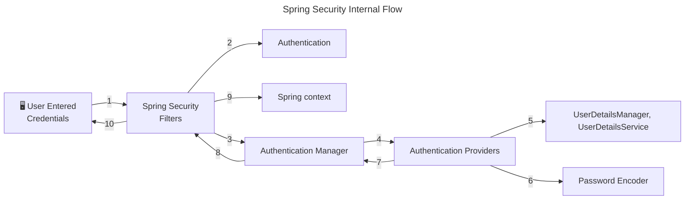
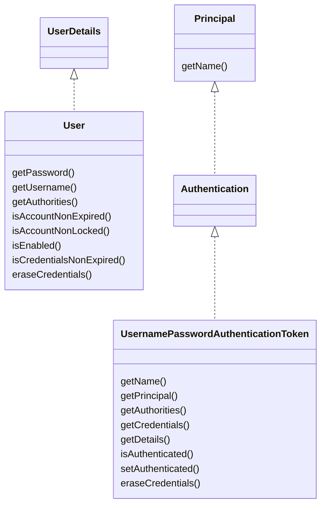
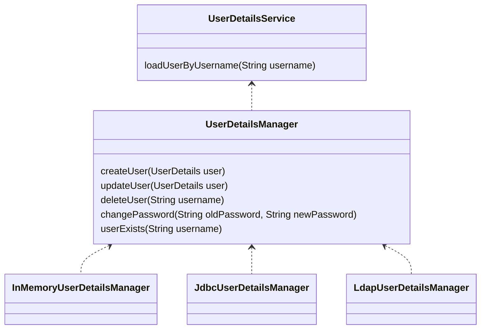
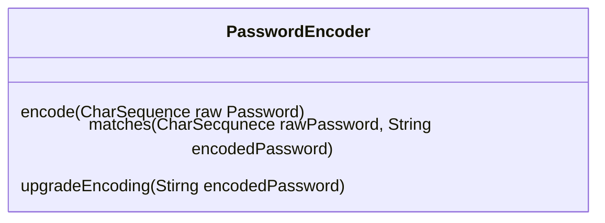
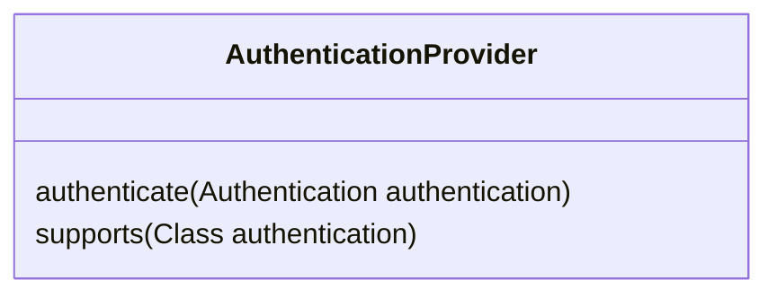
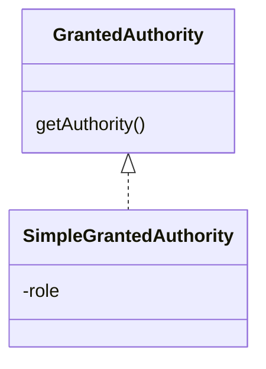

# spring-security-study

spring security에 대해 공부한 내용을 정리합니다.

## 스프링 시큐리티를 쓰는 이유

* 증가하는 보안 위협에 대해 프레임워크 사용만으로 대응이 가능
  * 해커들은 항상 침입할 준비를 하고 있고 보안 취약점은 매일 같이 갱신됨
  * 따라서 보안 영역은 어렵고 힘든 부분일 수밖에 없음
  * 보안에 대한 걱정은 프레임워크에 맡기고 비즈니스 로직에 집중할 수 있음
  * 스프링 시큐리티는 여러 전문가들이 수많은 보안 시나리오에 대해 고민하며 만든 프로젝트
  * 새로운 취약점이 발견되면 여러 집단들이 수정해 나감
  * 스프링 시큐리티는 최소한의 설정만으로 보안을 향상할 수 있음

## 스프링 시큐리티 흐름



## 스프링 시큐리티 필터

스프링 시큐리티에서는 요청과 응답을 가로채는 필터가 존재

약 20종 이상

* AuthorizationFilter - 공개 URL인 경우에만 통과
* DefaultLoginPageGeneratingFilter - 비공개 URL 접근시 기본 로그인 페이지 보여줌
* UsernamePasswordAuthenticationFilter - username과 password를 요청 서블릿에서 뽑아내는 역할
  * UsernamePasswordAuthenticationToken(Authentication 구현체) 생성해줌 
  * ProviderManager(AuthenticationManager의 구현체)에 인증 요청(authenticate() 메서드)
    * ProviderManager는 여러 AuthenticationProvider을 인증 성공할 때까지 순회 
  * DaoAuthenticationProvider(AbstractUserDetailsAuthenticationProvider의 구현체)
    * authenticate()가 인증 로직 수행
      * retrieveUser()가 사용자 정보 가져옴
      * retrieveUser()는 UserDetailsManager, UserDetailsService의 도움을 받음
      * 저장소에서 사용자 정보를 가져와야 할 때 UserDetailsManager, UserDetailsService을 사용
      * PasswordEncoder는 비밀번호를 암호화(해시)하는 데 사용
  * DaoAuthenticationProvider는 InMemoryUserDetailsManager(UserDetailsManager 구현체)를 사용하여 사용자 정보를 가져옴
    * `application.properties`에서 username과 password를 설정하면 in-memory에 로드됨
    * retreiveUser() 메서드가 로드된 username과 password를 바탕으로 UserDetails 객체를 생성해줌
    * 이 UserDetails를 additionalAuthenticationChecks() 메서드에게 전달하고 이 메서드는 기본 PasswordEncdoder를 사용하여 일치하는지 확인함

## 스프링 시큐리티 기본 필터 체인 구현하기

`SpringBootWebSecurityConfiguration` 클래스 내부에는 기본 설정을 변경하지 않았을 때 사용되는 기본 스프링 시큐리티 필터 체인이 존재함

```java
class SpringBootWebSecurityConfiguration {
    //...
    @Bean
    @Order(SecurityProperties.BASIC_AUTH_ORDER)
    SecurityFilterChain defaultSecurityFilterChain(HttpSecurity http) throws Exception {
        http.authorizeHttpRequests((requests) -> requests.anyRequest().authenticated());
        http.formLogin(withDefaults());
        http.httpBasic(withDefaults());
        return http.build();
    }
    //...
}
```
필터 체인을 새로 구현하여 빈으로 등록하지 않는다면, 위 코드 그대로 등록됨

### 예제 구성

* `/contact`, `/notices`는 보안 인증 없이 접근 가능
* `/myAccount`, `myBalance`, `myLoans`, `myCards`는 접근 시 보안 인증 필요

보안 요구사항을 구현하기 위해서는 스프링 필터 체인을 알맞게 구현하면 됨

```java
@Configuration
public class ProjectSecurityConfig {
    @Bean
    SecurityFilterChain defaultSecurityFilterChain(HttpSecurity http) throws Exception {
        http.authorizeHttpRequests(requests -> requests.requestMatchers(
                                "/myAccount",
                                "/myBalance",
                                "/myLoans",
                                "/myCards"
                        ).authenticated()
                        .requestMatchers(
                                "/notices",
                                "/contact"
                        ).permitAll())
                .formLogin(withDefaults())
                .httpBasic(withDefaults());
        return http.build();
    }
}
```

## 연습용 코드
아래 코드들은 실무에서는 쓰면 안 되지만 연습 혹은 데모 프로그램을 위한 보안 설정임

1. 사용자 정보를 인메모리에 저장

인메모리에 username과 password를 저장하기 위해서는 문자열을 하드 코딩해야 하므로 절대 권장하지 않는다.

```java
@Configuration
public class ProjectSecurityConfig {
    //...
    @Bean
    InMemoryUserDetailsManager userDetailService() {
        UserDetails admin = User.withDefaultPasswordEncoder()
                .username("admin")
                .password("12345")
                .authorities("admin")
                .build();

        UserDetails user2 = User.withDefaultPasswordEncoder()
                .username("user")
                .password("12345")
                .authorities("read")
                .build();

        return new InMemoryUserDetailsManager(admin, user);
    }
}
```

2. 비밀번호를 암호화하지 않기

비밀번호를 평문으로 저장, 비교
```java
@Configuration
public class ProjectSecurityConfig {
    //...
    @Bean
    InMemoryUserDetailsManager userDetailService() {
      UserDetails admin = User.withUsername("admin")
              .password("12345")
              .authorities("admin")
              .build();

      UserDetails user = User.withUsername("user")
              .password("12345")
              .authorities("read")
              .build();

      return new InMemoryUserDetailsManager(admin, user);
    }

    @Bean
    public PasswordEncoder passwordEncoder() {
      return NoOpPasswordEncoder.getInstance();
    }
}
```

## 사용자 정보 관리

* UserDetailsService - loadUserByUsername()로 사용자 정보 가져옴
  * username과 password 두 가지 정보가 아닌 username으로만 조회하는 이유 - 불필요하게 실제 비밀번호를 네트워크나 데이터베이스 서버로 전송할 필요 없음 
  * UserDetailsManager - UserDetailsService를 확장
    * 사용자 생성, 수정, 삭제, 비밀번호 변경, 존재 확인 등 메서드 제공
    * UserDetailsManager를 확장한 InMemoryUserDetailsManager, JdbcUserDetailsManager, LdapDetailsManager 클래스가 존재
  * 스프링이 제공하는 인터페이스, 클래스일뿐이며 독자적인 로직이 있다면 사용하지 않아도 됨
* UserDetails - 사용자 정보(username, password, authorities)를 나타내는 인터페이스
  * 스프링이 구현해놓은 UserDetails 구현체인 User를 사용해도 되며, 직접 UserDetails를 구현하여 사용해도 됨
  * UserDetails에는 보안상의 이유로 setter가 존재하지 않음. 즉, 한번 생성된 이후 username, password, authorities를 변경할 수 없음.

### UserDetails vs. Authentication

UserDetails는 저장소에서 사용자 정보를 가져올 때 사용되는 리턴 타입(UserDetailsService나 UserDetailsManger 등)

Authentication은 인증 성공 여부를 결정할 때 사용되는 리턴 타입(AuthenticationProvider나 AuthenticationManager 등)

### UserDetailsService & UserDetailsManager



UserDetailsService는 저장소에서 사용자 정보를 가져오는 역할

UserDetailsManager는 사용자 정보와 관련된 동작들을 가지고 있음

### JdbcUserDetailsManager
JdbcUserDetailsManager는 사용자 정보를 저장하기 위한 테이블 스키마를 갖고 있고, 이 스키마를 사용하지 않고 자신만의 테이블 스키마를 사용하려면

## @EnableWebSecurity
Spring Boot가 아닌 스프링 프로젝트에서는 웹 시큐리티를 활성화하기 위해 @EnableWebSecurity 애너테이션을 사용해야 함

Spring Boot 애플리케이션에서는 자동으로 웹 시큐리티를 활성화함

## PasswordEncoder

비밀번호를 암호화하지 않고 평문으로 저장하는 것은 무결성, 기밀성에 위배

* NoOpPasswordEncoder
  * 비밀번호를 암호화하지 않는 PasswordEncoder. 실무에서 사용해서는 안 됨.
* ~~StandardPasswordEncoder~~
  * Deprecated. 안전하지 않음.
  * 레거시 애플리케이션들을 지원하기 위해서만 사용
  * SHA-256 해싱 알고리즘, 랜덤 salt 값 사용
  * 보안성과 다른 언어와의 상호운용성을 위해 다른 PasswordEncoder 사용 권장
* Pbkdf2PasswordEncoder
  * 과거에는 안전성을 인정받았으나 프로세서 성능 발전으로 현재는 안전하지 않음
* BCryptPasswordEncoder
  * 1999년 고안된 BCrypt 해싱 알고리즘 사용
  * round 수를 늘릴수록 더 많은 연산 처리 능력 필요
* SCryptPasswordEncoder
  * BCryptPasswordEncoder 보다 발전된 형태
  * 해킹 위해서는 더 많은 연산 처리 능력과 메모리 모두 필요 
* Argon2PasswordEncoder
  * 가장 최신 해싱 알고리즘
  * 해킹 위해서는 연산 처리능력, 메모리, 다중 스레드가 요구됨
  * 해킹을 위해서 더 많은 시간이 소모되는 만큼, 애플리케이션 동작 시(가입, 로그인 등)에도 시간 소요 큼

## Encoding vs. Encryption vs. Hashing
Encoding은 단순히 데이터를 다른 형태로 변환하는 것. 암호화와는 관련이 없으며 보안 목적으로 사용되지 않음.
ex) ASCII, BASE64, Unicode

Encryption은 기밀성을 보장하기 위한 데이터 변환 방법. 기밀성을 달성하기 위해 일종의 비밀 데이터인 키(key)가 필요하며, 키 없이는 복호화를 수행할 수 없음.

Hashing은 데이터를 해시 함수를 사용하여 해시 값으로 변환하는 과정. 한번 해시된 데이터는 복원할 수 없음. 임의의 해시 결과 값을 비교했을 때, 그 값이 같다면 원본 값이 일치한다는 것을 검증할 수 있음.

## BCryptPasswordEncoder
* version - BCrypt 버전. 2a, 2b, 2y가 있음.
* strength - 로그 자릿수. 4 ~ 31 사이의 정수
* random - salt로 사용할 SecureRandom 객체(난수)

## AuthenticationProvider

여러 인증 수단을 지원하기 위해 여러 AuthenticationProvider 사용 가능
* username, password 사용
* OAuth 2.0 인증 사용
* OTP 인증 사용

## CORS & CSRF
CORS는 클라이언트 브라우저에서 실행되는 스크립트가 다른 출처의 리소스와 상호작용할 수 있도록 하는 프로토콜.

W3C가 제정한 규약이며 대다수의 브라우저들에 구현되어 있음

CORS는 보안 위협이나 공격 방법이 아니라 다른 출처 간의 데이터 공유 및 통신을 막기 위한 브라우저의 기본적인 방어 수단이다.

여기서 다른 출처의 리소스란 URL의 스킴, 도메인, 포트 중 하나라도 다른 리소스를 말한다.

브라우저에서는 출처가 다른 리소스 간의 통신을 제한하므로(Same Origin Policy, SOP), 스프링 애플리케이션 교차 출처 간 통신을 위해서는 다음의 방법을 사용할 수 있음

* @CrossOrigin 사용
  * `@CrossOrigin(orgin = "*")`: 모든 출처를 허용
  * `@CrossOrigin(orgin = "http://localhost:4200")`: 제시된 출처만 허용
* 전역적으로 허용하기 위해서는 security 설정 변경
```java
public class ProjectSecurityConfig {
    //...
    @Bean
    public SecurityFilterChain defaultSecurityFilterChain(HttpSecurity http) throws Exception {
        http.authorizeHttpRequests(requests -> requests.requestMatchers(
                                "/myAccount",
                                "/myBalance",
                                "/myLoans",
                                "/myCards"
                        ).authenticated()
                //...
                )
                .cors(httpSecurityCorsConfigurer -> {
                    httpSecurityCorsConfigurer.configurationSource(request -> {
                        CorsConfiguration corsConfiguration = new CorsConfiguration();
                        corsConfiguration.setAllowedOrigins(List.of("http://localhost:4200"));
                        corsConfiguration.setAllowedMethods(List.of("*"));
                        corsConfiguration.setAllowCredentials(true);
                        corsConfiguration.setAllowedHeaders(List.of("*"));
                        corsConfiguration.setMaxAge(3600L);
                        return corsConfiguration;
                    });
                });
        return http.build();
    }
}
```

CSRF(Cross-Site Request Forgery)는 CORS와 다르게 보안 공격임

사용자의 신원 정보를 직접 훔치는 것이 아니라 사용자로 하여금 특정 행위를 수행하도록 유도함

ex) 웹 사이트에 로그인된 상태에서 사용자가 외부 링크 클릭 시 로그인된 웹사이트의 보안 필요 동작을 수행을 하게 됨

기본적으로 Spring Security는 CSRF 보호 기능을 제공하며 POST나 PUT 연산 등 DB 삽입 또는 수정 시 적용됨

해결책은 로그인 시에 임의로 생성된 CSRF 토큰을 주고 요청 발생 시에 토큰을 검증함

Spring Security에서 CSRF를 실무에서 비활성화하는 것은 지양해야 함

```java
public class ProjectSecurityConfig {
    //...
    @Bean
    SecurityFilterChain defaultSecurityFilterChain(HttpSecurity http) throws Exception {
        CsrfTokenRequestAttributeHandler requestHandler = new CsrfTokenRequestAttributeHandler();
        requestHandler.setCsrfRequestAttributeName("_csrf");

        http.authorizeHttpRequests(requests -> requests.requestMatchers(
                        "/myAccount",
                        "/myBalance",
                        "/myLoans",
                        "/myCards"
                ).authenticated()
                 //...
                )
                .csrf(httpSecurityCsrfConfigurer -> {
                    httpSecurityCsrfConfigurer.ignoringRequestMatchers("/contact", "/register");
                    httpSecurityCsrfConfigurer.csrfTokenRequestHandler(requestHandler)
                            .csrfTokenRepository(CookieCsrfTokenRepository.withHttpOnlyFalse());
                });
      return http.build();
    }
}
```

### OncePerRequestFilter의 구현
로그인 이후에 CSRF 토큰 값(쿠키와 헤더 값)을 UI 애플리케이션으로 보내야 함 

이때 OncePerRequestFilter 구현체에서 쿠키 없이 헤더에만 토큰 보내면 Spring Security가 자동으로 쿠키 생성해줌

`.addFilterAfter(new CsrfCookieFilter(), BasicAuthenticationFilter.class)`을 csrf() 메서드 뒤에 추가

```text
.securityContext(httpSecuritySecurityContextConfigurer ->
                        httpSecuritySecurityContextConfigurer.requireExplicitSave(false))
.sessionManagement(httpSecuritySessionManagementConfigurer ->
        httpSecuritySessionManagementConfigurer.sessionCreationPolicy(SessionCreationPolicy.ALWAYS))
```
위 코드 추가해야 UI application에 JSESSIONID를 항상 처음 로그인 이후에 생성해달라고 해줌. 만약에 없으면 매 요청 시마다 로그인해야 함.

# authentication(AuthN) vs. authorization(AuthZ)
authentication은 웹 애플리케이션에 접속하려는 사용자가 누구인지 식별하는 것

실패 시 401 Unauthorized 에러 응답

authorization은 "인증 이후" 특정 사용자가 가진 권한이 무엇인지 확인하는 것

실패시 403 Forbidden 에러 응답

Spring Security에서는 authority, role로 구분함



Authority 생성 시 role 필요

## Authority 설정
RequestMatcher에 다음 메서드 사용
* hasAuthority() - 하나의 authority를 받음. 제시된 authority가 있어야 엔드포인트 통과 가능.
* hasAnyAuthority() - 여러 개의 authority를 받음. 제시된 authority 중 하나라도 있으면 엔드포인트 통과 가능.
* access() - SpEL 사용 사용하여 복잡한 규칙 사용 가능

## authority vs. role
authority는 하나의 권한이나 행위를 뜻함(fine-grained)

role은 권한이나 행위의 묶음임(coarse-grained)

Spring Security에서는 authority와 role 모두 grated authority 인터페이스로 표현하지만 role은 특별히 `ROLE_` 접두어를 붙여야 함

## Role 설정
RequestMatcher에 다음 메서드 사용. 사용 시에는 `ROLE_` 접두어를 빼고 입력해야 함.
* hasRole() - 하나의 role을 받음. 제시된 role이 있어야 엔드포인트 통과 가능.
* hasAnyRole() - 여러 개의 role을 받음. 제시된 role 중 하나라도 있으면 엔드포인트 통과 가능.
* access() - SpEL 사용 사용하여 복잡한 규칙 사용 가능

## Custom Filter
입력 검증, 추적, 감사, 보고, IP 주소 로깅, 암복호화, OTP 멀티 팩터 인증 등 보안 이슈 처리가 필요할 때 스프링 시큐리티의 HTTP 필터를 사용할 수 있음

필터는 스프링 시큐리티가 사용하는 중요한 서블릿 개념임

* 필터 확인하기 위해 보안 로그 활성화 - 실무에서 사용 금지
  * @EnableWebSecurity(debug = true)
  * application.propterties
    * logging.leve.org.springframework.securityWebFilterChainProxy=DEBUG

* 시큐리티 필터 체인 내 기본 활성 필터 목록
  * DisableEncodeUrlFilter
  * WebAsyncManagerIntegrationFilter
  * SecurityContextHolderFilter
  * HeaderWriterFilter
  * CorsFilter
  * CsrfFilter
  * LogoutFilter
  * UsernamePasswordAuthenticationFilter
  * DefaultLoginPageGeneratingFilter
  * DefaultLogoutPageGeneratingFilter
  * BasicAuthenticationFilter
  * RequestCacheAwareFilter
  * SecurityContextHolderAwareRequestFilter
  * AnonymousAuthenticationFilter
  * SessionManagementFilter
  * ExceptionTranslationFilter
  * FilterSecurityInterceptor

FilterChainProxy 내부 클래스인 VirtualFilterChain의 doFilter()가 활성화된 필터들을 순회하면서 로직을 실행함


## 토큰 사용 시 이점
credentials을 노출하지 않아도 됨

쉽게 만료 시킬 수 있음(해킹 또는 수상한 활동 발생 시)

사용자 관련 정보 (role, authority 등)

다른 서버나 환경에서 같은 토큰을 재사용할 수 있음

무상태성 및 확장 가능성 - 세션 상태에 대한 필요가 없으면서 토큰이 사용자를 식별할 수 있는 정보를 갖고 있기 때문에, 로드밸런서 사용 시 다른 서버에서도 인증 가능

## JWT
기존의 JSESSIONID 토큰은 임으로 생성된 문자열일뿐 아무런 사용자 데이터를 제공하지 못함

JWT(Json Web Token)은 내부적으로 사용자 정보를 JSON 형태로 저장함

JWT는 header, payload, signature로 구성됨(각각은 '.'으로 구분됨)

Header는 메타데이터(알고리즘, 타입, 포맷 등)를 저장

모든 JWT의 데이터는 평문으로 저장되지 않음

header는 Base64로 인코딩하도록 권장됨

payload(또는 body)는 사용자 정보가 저장되며 그 내용에는 제한이 없음. 하지만 내용은 가능한 최소화해야 함

payload 역시 Base64로 인코딩됨

header와 payload는 필수 사항이지만 signature는 그렇지 않음

signature가 있으면 다른 사람이 JWT를 위조했을 때 쉽게 발견할 수 있음

signature는 JWT를 생성할 때마다 수행되는 서명이며, 인코딩된 header와 payload를 사용하여 생성한 해시 값임.(HMAC-SHA-256 등 사용)

JWT 토큰을 저장소에 저장하지 않고도 JWT 토큰이 위조되지 않았는지 검증 가능

