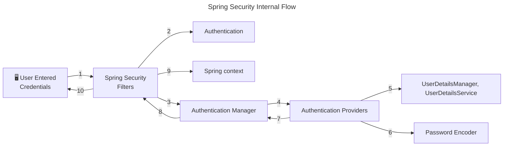
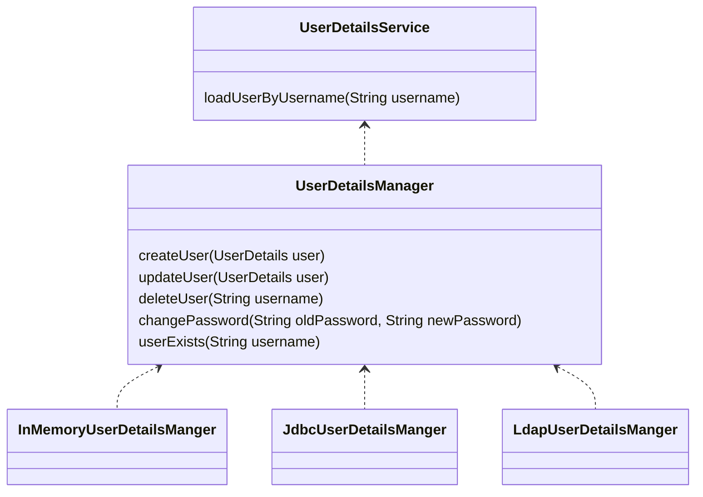

# spring-security-study

spring security에 대해 공부한 내용을 정리합니다.

## 스프링 시큐리티를 쓰는 이유

* 증가하는 보안 위협에 대해 프레임워크 사용만으로 대응이 가능
  * 해커들은 항상 침입할 준비를 하고 있고 보안 취약점은 매일 같이 갱신됨
  * 따라서 보안 영역은 어렵고 힘든 부분일 수밖에 없음
  * 보안에 대한 걱정은 프레임워크에 맡기고 비즈니스 로직에 집중할 수 있음
  * 스프링 시큐리티는 여러 전문가들이 수많은 보안 시나리오에 대해 고민하며 만든 프로젝트
  * 새로운 취약점이 발견되면 여러 집단들이 수정해 나감
  * 스프링 시큐리티는 최소한의 설정만으로 보안을 향상할 수 있음

## 스프링 시큐리티 흐름



## 스프링 시큐리티 필터

스프링 시큐리티에서는 요청과 응답을 가로채는 필터가 존재

약 20종 이상

* AuthorizationFilter - 공개 URL인 경우에만 통과
* DefaultLoginPageGeneratingFilter - 비공개 URL 접근시 기본 로그인 페이지 보여줌
* UsernamePasswordAuthenticationFilter - username과 password를 요청 서블릿에서 뽑아내는 역할
  * UsernamePasswordAuthenticationToken(Authentication 구현체) 생성해줌 
  * ProviderManager(AuthenticationManager의 구현체)에 인증 요청(authenticate() 메서드)
    * ProviderManager는 여러 AuthenticationProvider을 인증 성공할 때까지 순회 
  * DaoAuthenticationProvider(AbstractUserDetailsAuthenticationProvider의 구현체)
    * authenticate()가 인증 로직 수행
      * retrieveUser()가 사용자 정보 가져옴
      * retrieveUser()는 UserDetailsManager, UserDetailsService의 도움을 받음
      * 저장소에서 사용자 정보를 가져와야 할 때 UserDetailsManager, UserDetailsService을 사용
      * PasswordEncoder는 비밀번호를 암호화(해시)하는 데 사용
  * DaoAuthenticationProvider는 InMemoryUserDetailsManager(UserDetailsManager 구현체)를 사용하여 사용자 정보를 가져옴
    * `application.properties`에서 username과 password를 설정하면 in-memory에 로드됨
    * retreiveUser() 메서드가 로드된 username과 password를 바탕으로 UserDetails 객체를 생성해줌
    * 이 UserDetails를 additionalAuthenticationChecks() 메서드에게 전달하고 이 메서드는 기본 PasswordEncdoder를 사용하여 일치하는지 확인함

## 스프링 시큐리티 기본 필터 체인 구현하기

`SpringBootWebSecurityConfiguration` 클래스 내부에는 기본 설정을 변경하지 않았을 때 사용되는 기본 스프링 시큐리티 필터 체인이 존재함

```java
class SpringBootWebSecurityConfiguration {
    //...
    @Bean
    @Order(SecurityProperties.BASIC_AUTH_ORDER)
    SecurityFilterChain defaultSecurityFilterChain(HttpSecurity http) throws Exception {
        http.authorizeHttpRequests((requests) -> requests.anyRequest().authenticated());
        http.formLogin(withDefaults());
        http.httpBasic(withDefaults());
        return http.build();
    }
    //...
}
```
필터 체인을 새로 구현하여 빈으로 등록하지 않는다면, 위 코드 그대로 등록됨

### 예제 구성

* `/contact`, `/notices`는 보안 인증 없이 접근 가능
* `/myAccount`, `myBalance`, `myLoans`, `myCards`는 접근 시 보안 인증 필요

보안 요구사항을 구현하기 위해서는 스프링 필터 체인을 알맞게 구현하면 됨

```java
@Configuration
public class ProjectSecurityConfig {
    @Bean
    SecurityFilterChain defaultSecurityFilterChain(HttpSecurity http) throws Exception {
        http.authorizeHttpRequests(requests -> requests.requestMatchers(
                                "/myAccount",
                                "/myBalance",
                                "/myLoans",
                                "/myCards"
                        ).authenticated()
                        .requestMatchers(
                                "/notices",
                                "/contact"
                        ).permitAll())
                .formLogin(withDefaults())
                .httpBasic(withDefaults());
        return http.build();
    }
}
```

## 연습용 코드
아래 코드들은 실무에서는 쓰면 안 되지만 연습 혹은 데모 프로그램을 위한 보안 설정임

1. 사용자 정보를 인메모리에 저장

인메모리에 username과 password를 저장하기 위해서는 문자열을 하드 코딩해야 하므로 절대 권장하지 않는다.

```java
@Configuration
public class ProjectSecurityConfig {
    //...
    @Bean
    InMemoryUserDetailsManager userDetailService() {
        UserDetails admin = User.withDefaultPasswordEncoder()
                .username("admin")
                .password("12345")
                .authorities("admin")
                .build();

        UserDetails user2 = User.withDefaultPasswordEncoder()
                .username("user")
                .password("12345")
                .authorities("read")
                .build();

        return new InMemoryUserDetailsManager(admin, user);
    }
}
```

2. 비밀번호를 암호화하지 않기

비밀번호를 평문으로 저장, 비교
```java
@Configuration
public class ProjectSecurityConfig {
    //...
    @Bean
    InMemoryUserDetailsManager userDetailService() {
      UserDetails admin = User.withUsername("admin")
              .password("12345")
              .authorities("admin")
              .build();

      UserDetails user = User.withUsername("user")
              .password("12345")
              .authorities("read")
              .build();

      return new InMemoryUserDetailsManager(admin, user);
    }

    @Bean
    public PasswordEncoder passwordEncoder() {
      return NoOpPasswordEncoder.getInstance();
    }
}
```

## 사용자 정보 관리

* UserDetailsService - loadUserByUsername()로 사용자 정보 가져옴
  * username과 password 두 가지 정보가 아닌 username으로만 조회하는 이유 - 불필요하게 실제 비밀번호를 네트워크나 데이터베이스 서버로 전송할 필요 없음 
  * UserDetailsManager - UserDetailsService를 확장
    * 사용자 생성, 수정, 삭제, 비밀번호 변경, 존재 확인 등 메서드 제공
    * UserDetailsManager를 확장한 InMemoryUserDetailsManager, JdbcUserDetailsManager, LdapDetailsManager 클래스가 존재
  * 스프링이 제공하는 인터페이스, 클래스일뿐이며 독자적인 로직이 있다면 사용하지 않아도 됨
* UserDetails - 사용자 정보(username, password, authorities)를 나타내는 인터페이스
  * 스프링이 구현해놓은 UserDetails 구현체인 User를 사용해도 되며, 직접 UserDetails를 구현하여 사용해도 됨
  * UserDetails에는 보안상의 이유로 setter가 존재하지 않음. 즉, 한번 생성된 이후 username, password, authorities를 변경할 수 없음.

### UserDetails vs. Authentication

UserDetails는 저장소에서 사용자 정보를 가져올 때 사용되는 리턴 타입(UserDetailsService나 UserDetailsManger 등)

Authentication은 인증 성공 여부를 결정할 때 사용되는 리턴 타입(AuthenticationProvider나 AuthenticationManager 등)

### UserDetailsService & UserDetailsManager



UserDetailsService는 저장소에서 사용자 정보를 가져오는 역할

UserDetailsManager는 사용자 정보와 관련된 동작들을 가지고 있음

### 