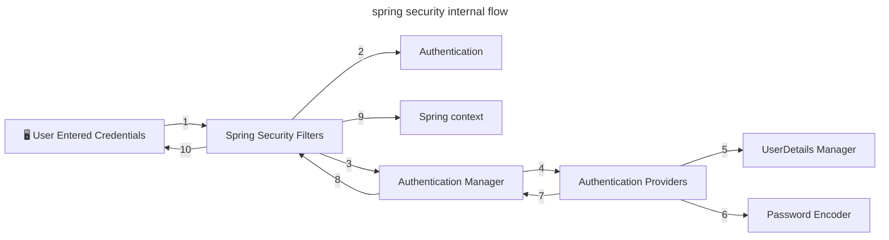

# spring-security-study
spring security에 대해 공부한 내용을 정리합니다.

## 스프링 시큐리티를 쓰는 이유
* 증가하는 보안 위협에 대해 프레임워크 사용만으로 대응이 가능
  * 해커들은 항상 침입할 준비를 하고 있고 보안 취약점은 매일 같이 갱신됨
  * 따라서 보안 영역은 어렵고 힘든 부분일 수밖에 없음
  * 보안에 대한 걱정은 프레임워크에 맡기고 비즈니스 로직에 집중할 수 있음
  * 스프링 시큐리티는 여러 전문가들이 수많은 보안 시나리오에 대해 고민하며 만든 프로젝트
  * 새로운 취약점이 발견되면 여러 집단들이 수정해 나감
  * 스프링 시큐리티는 최소한의 설정만으로 보안을 향상할 수 있음

## 스프링 시큐리티 흐름

## 스프링 시큐리티 필터
스프링 시큐리티에서는 요청과 응답을 가로채는 필터가 존재

약 20종 이상

* AuthorizationFilter - 공개 URL인 경우에만 통과
* DefaultLoginPageGeneratingFilter - 비공개 URL 접근시 기본 로그인 페이지 보여줌
* UsernamePasswordAuthenticationFilter - username과 password를 요청 서블릿에서 뽑아내는 역할
  * UsernamePasswordAuthenticationToken(Authentication 구현체) 생성해줌
  * AuthenticationManager에 인증 요청