# spring-security-study

spring security에 대해 공부한 내용을 정리합니다.

## 스프링 시큐리티를 쓰는 이유

* 증가하는 보안 위협에 대해 프레임워크 사용만으로 대응이 가능
    * 해커들은 항상 침입할 준비를 하고 있고 보안 취약점은 매일 같이 갱신됨
    * 따라서 보안 영역은 어렵고 힘든 부분일 수밖에 없음
    * 보안에 대한 걱정은 프레임워크에 맡기고 비즈니스 로직에 집중할 수 있음
    * 스프링 시큐리티는 여러 전문가들이 수많은 보안 시나리오에 대해 고민하며 만든 프로젝트
    * 새로운 취약점이 발견되면 여러 집단들이 수정해 나감
    * 스프링 시큐리티는 최소한의 설정만으로 보안을 향상할 수 있음

## 스프링 시큐리티 흐름

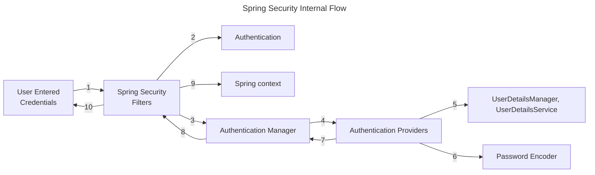

## 스프링 시큐리티 필터

스프링 시큐리티에서는 요청과 응답을 가로채는 필터가 존재

약 20종 이상

* AuthorizationFilter - 공개 URL인 경우에만 통과
* DefaultLoginPageGeneratingFilter - 비공개 URL 접근시 기본 로그인 페이지 보여줌
* UsernamePasswordAuthenticationFilter - username과 password를 요청 서블릿에서 뽑아내는 역할
    * UsernamePasswordAuthenticationToken(Authentication 구현체) 생성해줌
    * ProviderManager(AuthenticationManager의 구현체)에 인증 요청(authenticate() 메서드)
        * ProviderManager는 여러 AuthenticationProvider을 인증 성공할 때까지 순회
    * DaoAuthenticationProvider(AbstractUserDetailsAuthenticationProvider의 구현체)
        * authenticate()가 인증 로직 수행
            * retrieveUser()가 사용자 정보 가져옴
            * retrieveUser()는 UserDetailsManager, UserDetailsService의 도움을 받음
            * 저장소에서 사용자 정보를 가져와야 할 때 UserDetailsManager, UserDetailsService을 사용
            * PasswordEncoder는 비밀번호를 암호화(해시)하는 데 사용
    * DaoAuthenticationProvider는 InMemoryUserDetailsManager(UserDetailsManager 구현체)를 사용하여 사용자 정보를 가져옴
        * `application.properties`에서 username과 password를 설정하면 in-memory에 로드됨
        * retreiveUser() 메서드가 로드된 username과 password를 바탕으로 UserDetails 객체를 생성해줌
        * 이 UserDetails를 additionalAuthenticationChecks() 메서드에게 전달하고 이 메서드는 기본 PasswordEncdoder를 사용하여 일치하는지 확인함

## 스프링 시큐리티 기본 필터 체인 구현하기

`SpringBootWebSecurityConfiguration` 클래스 내부에는 기본 설정을 변경하지 않았을 때 사용되는 기본 스프링 시큐리티 필터 체인이 존재함

```java
class SpringBootWebSecurityConfiguration {
    //...
    @Bean
    @Order(SecurityProperties.BASIC_AUTH_ORDER)
    SecurityFilterChain defaultSecurityFilterChain(HttpSecurity http) throws Exception {
        http.authorizeHttpRequests((requests) -> requests.anyRequest().authenticated());
        http.formLogin(withDefaults());
        http.httpBasic(withDefaults());
        return http.build();
    }
    //...
}
```

필터 체인을 새로 구현하여 빈으로 등록하지 않는다면, 위 코드 그대로 등록됨

### 예제 구성

* `/contact`, `/notices`는 보안 인증 없이 접근 가능
* `/myAccount`, `myBalance`, `myLoans`, `myCards`는 접근 시 보안 인증 필요

보안 요구사항을 구현하기 위해서는 스프링 필터 체인을 알맞게 구현하면 됨

```java

@Configuration
public class ProjectSecurityConfig {
    @Bean
    SecurityFilterChain defaultSecurityFilterChain(HttpSecurity http) throws Exception {
        http.authorizeHttpRequests(requests -> requests.requestMatchers(
                                "/myAccount",
                                "/myBalance",
                                "/myLoans",
                                "/myCards"
                        ).authenticated()
                        .requestMatchers(
                                "/notices",
                                "/contact"
                        ).permitAll())
                .formLogin(withDefaults())
                .httpBasic(withDefaults());
        return http.build();
    }
}
```

## 연습용 코드

아래 코드들은 실무에서는 쓰면 안 되지만 연습 혹은 데모 프로그램을 위한 보안 설정임

1. 사용자 정보를 인메모리에 저장

인메모리에 username과 password를 저장하기 위해서는 문자열을 하드 코딩해야 하므로 절대 권장하지 않는다.

```java

@Configuration
public class ProjectSecurityConfig {
    //...
    @Bean
    InMemoryUserDetailsManager userDetailService() {
        UserDetails admin = User.withDefaultPasswordEncoder()
                .username("admin")
                .password("12345")
                .authorities("admin")
                .build();

        UserDetails user2 = User.withDefaultPasswordEncoder()
                .username("user")
                .password("12345")
                .authorities("read")
                .build();

        return new InMemoryUserDetailsManager(admin, user);
    }
}
```

2. 비밀번호를 암호화하지 않기

비밀번호를 평문으로 저장, 비교

```java

@Configuration
public class ProjectSecurityConfig {
    //...
    @Bean
    InMemoryUserDetailsManager userDetailService() {
        UserDetails admin = User.withUsername("admin")
                .password("12345")
                .authorities("admin")
                .build();

        UserDetails user = User.withUsername("user")
                .password("12345")
                .authorities("read")
                .build();

        return new InMemoryUserDetailsManager(admin, user);
    }

    @Bean
    public PasswordEncoder passwordEncoder() {
        return NoOpPasswordEncoder.getInstance();
    }
}
```

## 사용자 정보 관리

* UserDetailsService - loadUserByUsername()로 사용자 정보 가져옴
    * username과 password 두 가지 정보가 아닌 username으로만 조회하는 이유 - 불필요하게 실제 비밀번호를 네트워크나 데이터베이스 서버로 전송할 필요 없음
    * UserDetailsManager - UserDetailsService를 확장
        * 사용자 생성, 수정, 삭제, 비밀번호 변경, 존재 확인 등 메서드 제공
        * UserDetailsManager를 확장한 InMemoryUserDetailsManager, JdbcUserDetailsManager, LdapDetailsManager 클래스가 존재
    * 스프링이 제공하는 인터페이스, 클래스일뿐이며 독자적인 로직이 있다면 사용하지 않아도 됨
* UserDetails - 사용자 정보(username, password, authorities)를 나타내는 인터페이스
    * 스프링이 구현해놓은 UserDetails 구현체인 User를 사용해도 되며, 직접 UserDetails를 구현하여 사용해도 됨
    * UserDetails에는 보안상의 이유로 setter가 존재하지 않음. 즉, 한번 생성된 이후 username, password, authorities를 변경할 수 없음.

### UserDetails vs. Authentication

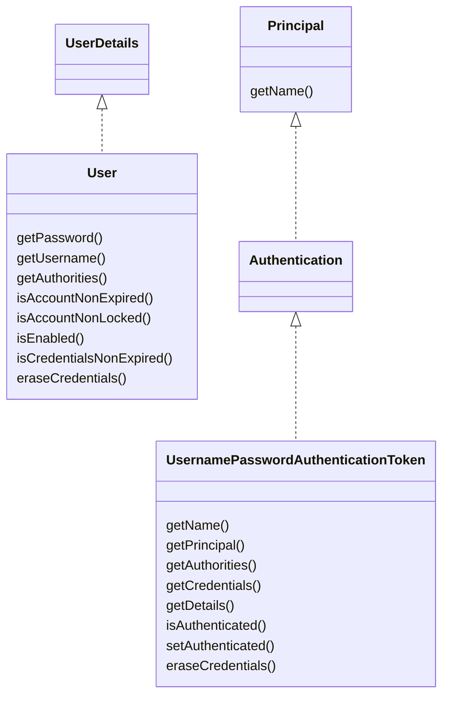

UserDetails는 저장소에서 사용자 정보를 가져올 때 사용되는 리턴 타입(UserDetailsService나 UserDetailsManger 등)

Authentication은 인증 성공 여부를 결정할 때 사용되는 리턴 타입(AuthenticationProvider나 AuthenticationManager 등)

### UserDetailsService & UserDetailsManager

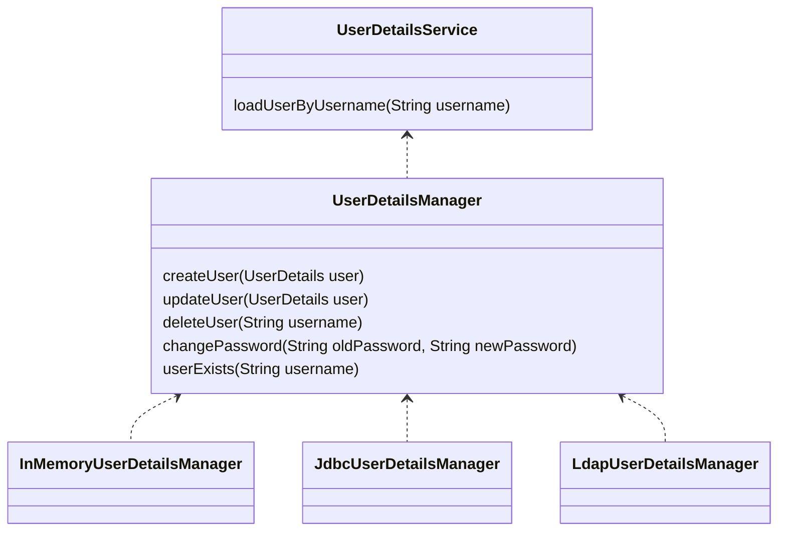

UserDetailsService는 저장소에서 사용자 정보를 가져오는 역할

UserDetailsManager는 사용자 정보와 관련된 동작들을 가지고 있음

### JdbcUserDetailsManager

JdbcUserDetailsManager는 사용자 정보를 저장하기 위한 테이블 스키마를 갖고 있고, 이 스키마를 사용하지 않고 자신만의 테이블 스키마를 사용하려면

## @EnableWebSecurity

Spring Boot가 아닌 스프링 프로젝트에서는 웹 시큐리티를 활성화하기 위해 @EnableWebSecurity 애너테이션을 사용해야 함

Spring Boot 애플리케이션에서는 자동으로 웹 시큐리티를 활성화함

## PasswordEncoder

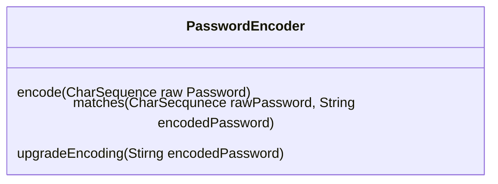

비밀번호를 암호화하지 않고 평문으로 저장하는 것은 무결성, 기밀성에 위배

* NoOpPasswordEncoder
    * 비밀번호를 암호화하지 않는 PasswordEncoder. 실무에서 사용해서는 안 됨.
* ~~StandardPasswordEncoder~~
    * Deprecated. 안전하지 않음.
    * 레거시 애플리케이션들을 지원하기 위해서만 사용
    * SHA-256 해싱 알고리즘, 랜덤 salt 값 사용
    * 보안성과 다른 언어와의 상호운용성을 위해 다른 PasswordEncoder 사용 권장
* Pbkdf2PasswordEncoder
    * 과거에는 안전성을 인정받았으나 프로세서 성능 발전으로 현재는 안전하지 않음
* BCryptPasswordEncoder
    * 1999년 고안된 BCrypt 해싱 알고리즘 사용
    * round 수를 늘릴수록 더 많은 연산 처리 능력 필요
* SCryptPasswordEncoder
    * BCryptPasswordEncoder 보다 발전된 형태
    * 해킹 위해서는 더 많은 연산 처리 능력과 메모리 모두 필요
* Argon2PasswordEncoder
    * 가장 최신 해싱 알고리즘
    * 해킹 위해서는 연산 처리능력, 메모리, 다중 스레드가 요구됨
    * 해킹을 위해서 더 많은 시간이 소모되는 만큼, 애플리케이션 동작 시(가입, 로그인 등)에도 시간 소요 큼

## Encoding vs. Encryption vs. Hashing

Encoding은 단순히 데이터를 다른 형태로 변환하는 것. 암호화와는 관련이 없으며 보안 목적으로 사용되지 않음.
ex) ASCII, BASE64, Unicode

Encryption은 기밀성을 보장하기 위한 데이터 변환 방법. 기밀성을 달성하기 위해 일종의 비밀 데이터인 키(key)가 필요하며, 키 없이는 복호화를 수행할 수 없음.

Hashing은 데이터를 해시 함수를 사용하여 해시 값으로 변환하는 과정. 한번 해시된 데이터는 복원할 수 없음. 임의의 해시 결과 값을 비교했을 때, 그 값이 같다면 원본 값이 일치한다는 것을 검증할 수 있음.

## BCryptPasswordEncoder

* version - BCrypt 버전. 2a, 2b, 2y가 있음.
* strength - 로그 자릿수. 4 ~ 31 사이의 정수
* random - salt로 사용할 SecureRandom 객체(난수)

## AuthenticationProvider

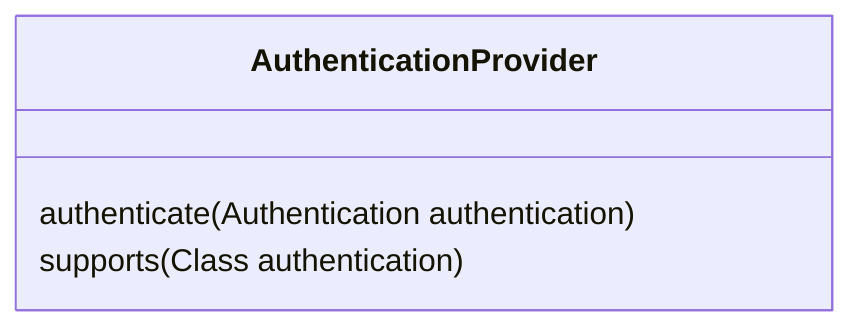

여러 인증 수단을 지원하기 위해 여러 AuthenticationProvider 사용 가능

* username, password 사용
* OAuth 2.0 인증 사용
* OTP 인증 사용

## CORS & CSRF

CORS는 클라이언트 브라우저에서 실행되는 스크립트가 다른 출처의 리소스와 상호작용할 수 있도록 하는 프로토콜.

W3C가 제정한 규약이며 대다수의 브라우저들에 구현되어 있음

CORS는 보안 위협이나 공격 방법이 아니라 다른 출처 간의 데이터 공유 및 통신을 막기 위한 브라우저의 기본적인 방어 수단이다.

여기서 다른 출처의 리소스란 URL의 스킴, 도메인, 포트 중 하나라도 다른 리소스를 말한다.

브라우저에서는 출처가 다른 리소스 간의 통신을 제한하므로(Same Origin Policy, SOP), 스프링 애플리케이션 교차 출처 간 통신을 위해서는 다음의 방법을 사용할 수 있음

* @CrossOrigin 사용
    * `@CrossOrigin(orgin = "*")`: 모든 출처를 허용
    * `@CrossOrigin(orgin = "http://localhost:4200")`: 제시된 출처만 허용
* 전역적으로 허용하기 위해서는 security 설정 변경

```java
public class ProjectSecurityConfig {
    //...
    @Bean
    public SecurityFilterChain defaultSecurityFilterChain(HttpSecurity http) throws Exception {
        http.authorizeHttpRequests(requests -> requests.requestMatchers(
                                "/myAccount",
                                "/myBalance",
                                "/myLoans",
                                "/myCards"
                        ).authenticated()
                        //...
                )
                .cors(httpSecurityCorsConfigurer -> {
                    httpSecurityCorsConfigurer.configurationSource(request -> {
                        CorsConfiguration corsConfiguration = new CorsConfiguration();
                        corsConfiguration.setAllowedOrigins(List.of("http://localhost:4200"));
                        corsConfiguration.setAllowedMethods(List.of("*"));
                        corsConfiguration.setAllowCredentials(true);
                        corsConfiguration.setAllowedHeaders(List.of("*"));
                        corsConfiguration.setMaxAge(3600L);
                        return corsConfiguration;
                    });
                });
        return http.build();
    }
}
```

CSRF(Cross-Site Request Forgery)는 CORS와 다르게 보안 공격임

사용자의 신원 정보를 직접 훔치는 것이 아니라 사용자로 하여금 특정 행위를 수행하도록 유도함

ex) 웹 사이트에 로그인된 상태에서 사용자가 외부 링크 클릭 시 로그인된 웹사이트의 보안 필요 동작을 수행을 하게 됨

기본적으로 Spring Security는 CSRF 보호 기능을 제공하며 POST나 PUT 연산 등 DB 삽입 또는 수정 시 적용됨

해결책은 로그인 시에 임의로 생성된 CSRF 토큰을 주고 요청 발생 시에 토큰을 검증함

Spring Security에서 CSRF를 실무에서 비활성화하는 것은 지양해야 함

```java
public class ProjectSecurityConfig {
    //...
    @Bean
    SecurityFilterChain defaultSecurityFilterChain(HttpSecurity http) throws Exception {
        CsrfTokenRequestAttributeHandler requestHandler = new CsrfTokenRequestAttributeHandler();
        requestHandler.setCsrfRequestAttributeName("_csrf");

        http.authorizeHttpRequests(requests -> requests.requestMatchers(
                                "/myAccount",
                                "/myBalance",
                                "/myLoans",
                                "/myCards"
                        ).authenticated()
                        //...
                )
                .csrf(httpSecurityCsrfConfigurer -> {
                    httpSecurityCsrfConfigurer.ignoringRequestMatchers("/contact", "/register");
                    httpSecurityCsrfConfigurer.csrfTokenRequestHandler(requestHandler)
                            .csrfTokenRepository(CookieCsrfTokenRepository.withHttpOnlyFalse());
                });
        return http.build();
    }
}
```

### OncePerRequestFilter의 구현

로그인 이후에 CSRF 토큰 값(쿠키와 헤더 값)을 UI 애플리케이션으로 보내야 함

이때 OncePerRequestFilter 구현체에서 쿠키 없이 헤더에만 토큰 보내면 Spring Security가 자동으로 쿠키 생성해줌

`.addFilterAfter(new CsrfCookieFilter(), BasicAuthenticationFilter.class)`을 csrf() 메서드 뒤에 추가

```text
.securityContext(httpSecuritySecurityContextConfigurer ->
                        httpSecuritySecurityContextConfigurer.requireExplicitSave(false))
.sessionManagement(httpSecuritySessionManagementConfigurer ->
        httpSecuritySessionManagementConfigurer.sessionCreationPolicy(SessionCreationPolicy.ALWAYS))
```

위 코드 추가해야 UI application에 JSESSIONID를 항상 처음 로그인 이후에 생성해달라고 해줌. 만약에 없으면 매 요청 시마다 로그인해야 함.

# authentication(AuthN) vs. authorization(AuthZ)

authentication은 웹 애플리케이션에 접속하려는 사용자가 누구인지 식별하는 것

실패 시 401 Unauthorized 에러 응답

authorization은 "인증 이후" 특정 사용자가 가진 권한이 무엇인지 확인하는 것

실패시 403 Forbidden 에러 응답

Spring Security에서는 authority, role로 구분함

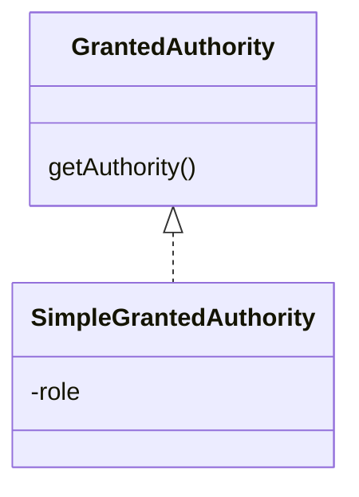

Authority 생성 시 role 필요

## Authority 설정

RequestMatcher에 다음 메서드 사용

* hasAuthority() - 하나의 authority를 받음. 제시된 authority가 있어야 엔드포인트 통과 가능.
* hasAnyAuthority() - 여러 개의 authority를 받음. 제시된 authority 중 하나라도 있으면 엔드포인트 통과 가능.
* access() - SpEL 사용 사용하여 복잡한 규칙 사용 가능

## authority vs. role

authority는 하나의 권한이나 행위를 뜻함(fine-grained)

role은 권한이나 행위의 묶음임(coarse-grained)

Spring Security에서는 authority와 role 모두 grated authority 인터페이스로 표현하지만 role은 특별히 `ROLE_` 접두어를 붙여야 함

## Role 설정

RequestMatcher에 다음 메서드 사용. 사용 시에는 `ROLE_` 접두어를 빼고 입력해야 함.

* hasRole() - 하나의 role을 받음. 제시된 role이 있어야 엔드포인트 통과 가능.
* hasAnyRole() - 여러 개의 role을 받음. 제시된 role 중 하나라도 있으면 엔드포인트 통과 가능.
* access() - SpEL 사용 사용하여 복잡한 규칙 사용 가능

## Custom Filter

입력 검증, 추적, 감사, 보고, IP 주소 로깅, 암복호화, OTP 멀티 팩터 인증 등 보안 이슈 처리가 필요할 때 스프링 시큐리티의 HTTP 필터를 사용할 수 있음

필터는 스프링 시큐리티가 사용하는 중요한 서블릿 개념임

* 필터 확인하기 위해 보안 로그 활성화 - 실무에서 사용 금지
    * @EnableWebSecurity(debug = true)
    * application.propterties
        * logging.leve.org.springframework.securityWebFilterChainProxy=DEBUG

* 시큐리티 필터 체인 내 기본 활성 필터 목록
    * DisableEncodeUrlFilter
    * WebAsyncManagerIntegrationFilter
    * SecurityContextHolderFilter
    * HeaderWriterFilter
    * CorsFilter
    * CsrfFilter
    * LogoutFilter
    * UsernamePasswordAuthenticationFilter
    * DefaultLoginPageGeneratingFilter
    * DefaultLogoutPageGeneratingFilter
    * BasicAuthenticationFilter
    * RequestCacheAwareFilter
    * SecurityContextHolderAwareRequestFilter
    * AnonymousAuthenticationFilter
    * SessionManagementFilter
    * ExceptionTranslationFilter
    * FilterSecurityInterceptor

FilterChainProxy 내부 클래스인 VirtualFilterChain의 doFilter()가 활성화된 필터들을 순회하면서 로직을 실행함

커스텀 필터를 만드려면 jakarta.servlet.Filter 클래스(구 javax.servlet.Filter)를 구현하면 됨

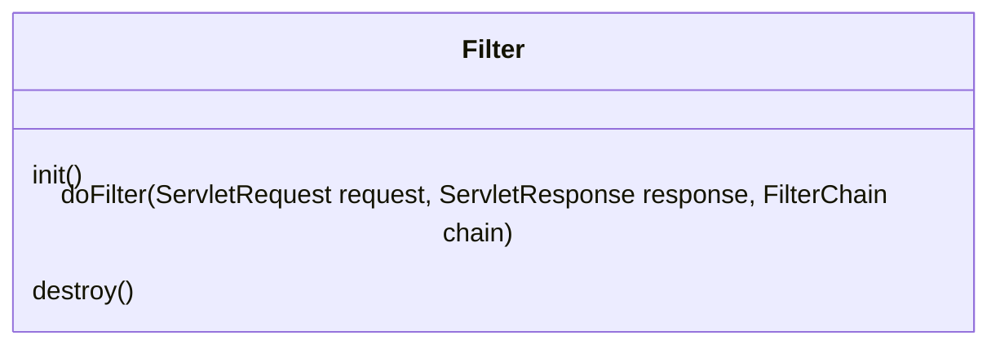

## 커스텀 필터 추가 예제

doChain() 메서드에 비즈니스 로직을 구현 후 아래 메서드를 사용하여 필터 체인에 커스텀 필터를 추가

* addFilterBefore(filter, class) - 특정 필터의 앞에 필터를 추가
* addFilterAfter(filter, class) - 특정 필터의 뒤에 필터를 추가
* addFilterAt(filter, class) - 특정 필터 위치에 필터를 추가

커스텀 필터에 DB query나 긴 코드 등 오래 걸리는 로직 작성 금지 - 요청 전체에 영향 주기 때문

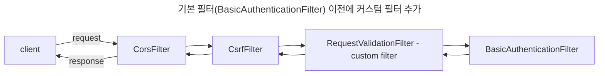

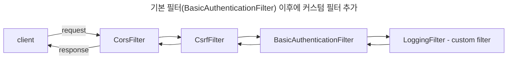

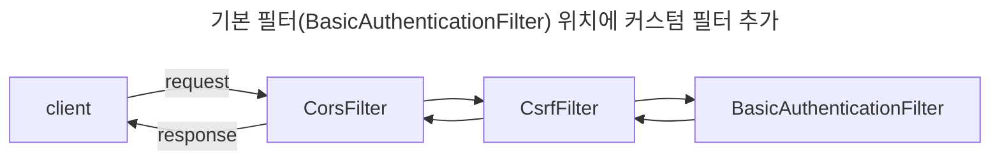

마지막 예제(addFilterAt())의 경우 순서를 보장할 수 없으며, 기존 필터를 대체하지 않는다

필터 순서를 통제할 수 없고 임의로 순서가 정해지기 때문에 같은 위치에 필터를 넣는 것은 피해야 함

## 커스텀 필터 추가를 위한 다른 방법들

### GenericFilterBean

모든 설정 매개변수, init 매개변수, 서블릿 컨텍스트 매개변수 등 세부사항에 접근 가능한 필터 추상 클래스

### OncePerRequestFilter

기본적으로 스프링 시큐리티나 스프링 프레임워크는 필터가 요청당 한 번 실행된다는 보장을 해주지 않음

요청당 한 번 실행을 보장해야 한다면 OncePerRequestFilter를 사용

OncePerRequestFilter는 비즈니스 구현을 doFilter()가 아닌 doFilterInternal()에 하면 됨

BasicAuthenticationFilter도 OncePerRequestFilter를 확장한 클래스

## 토큰 사용 시 이점

credentials을 노출하지 않아도 됨

쉽게 만료 시킬 수 있음(해킹 또는 수상한 활동 발생 시)

사용자 관련 정보 (role, authority 등)

다른 서버나 환경에서 같은 토큰을 재사용할 수 있음

무상태성 및 확장 가능성 - 세션 상태에 대한 필요가 없으면서 토큰이 사용자를 식별할 수 있는 정보를 갖고 있기 때문에, 로드밸런서 사용 시 다른 서버에서도 인증 가능

## JWT

기존의 JSESSIONID 토큰은 임으로 생성된 문자열일뿐 아무런 사용자 데이터를 제공하지 못함

JWT(Json Web Token)은 내부적으로 사용자 정보를 JSON 형태로 저장함

JWT는 header, payload, signature로 구성됨(각각은 '.'으로 구분됨)

Header는 메타데이터(알고리즘, 타입, 포맷 등)를 저장

모든 JWT의 데이터는 평문으로 저장되지 않음

header는 Base64로 인코딩하도록 권장됨

payload(또는 body)는 사용자 정보가 저장되며 그 내용에는 제한이 없음. 하지만 내용은 가능한 최소화해야 함

payload 역시 Base64로 인코딩됨

header와 payload는 필수 사항이지만 signature는 그렇지 않음

signature가 있으면 다른 사람이 JWT를 위조했을 때 쉽게 발견할 수 있음

signature는 JWT를 생성할 때마다 수행되는 서명이며, 인코딩된 header와 payload를 사용하여 생성한 해시 값임.(HMAC-SHA-256 등 사용)

JWT 토큰을 저장소에 저장하지 않고도 JWT 토큰이 위조되지 않았는지 검증 가능

## JWT 토큰 예제
OncePerRequestFilter를 확장하여 구현

Jwt 빌더를 이용해 JWT 토큰을 생성하고 응답 헤더 Authorization에 토큰을 넣어 응답

URL `/user`에만 적용하도록 않도록 `shouldNotFilter()` 메서드 오버라이드


## 메서드 수준 보안
스프링 시큐리티는 authorization을 API 경로나 URL뿐만 아니라 메서드 수준에 적용할 수 있음

메서드 수준 보안은 @EnableMethodSecurity 애너테이션을 통해 활성화함

* 호출 authorization
  * 사용자의 role, authority에 따라 메서드를 호출할 수 있는지 검증
* authorization 필터링
  * 메서드가 받을 수 있는 매개변수와 호출자가 메서드 로직 실행을 통해 리턴받을 수 있는 값인지 검증

메서드 수준 보안은 항상 2차 보안으로서만 작동함. 그렇기에 보안 수준을 향상시킬 수 있음.

스프링 시큐리티는 authorization규칙을 설정하기 위해 AOP의 애스펙트와 메서드 호출 사이의 인터셉트를 사용함

스프링이 제공하는 메서드 수준 보안의 3가지 스타일 옵션
* prePostEnabled 프로퍼티 - @PreAuthorize & @PostAuthorize 사용 가능 설정
* securedEnabled 프로퍼티 - @Secured 사용 가능 설정
* jsr250Enabled 프로퍼티 - @RoleAllowed 사용 가능 설정

```java
@Configuration
@EnableMethodSecurity(prePostEnabled = true, securedEnabled = true, jsr250Enabled = true)
public class ProjectSecurityConfig {
  //...
}

```

### @PreAuthorize, @PostAuthorize
* @PreAuthorize
  * 메서드 실행 전 사용자가 요구 조건 충족하는지
* @PostAuthorize
  * 메서드 실행 후 사용자가 요구 조건 충족하는지'

authorization 규칙 작성을 위한 메서드
* `hasAuthority()`, `hasAnyAuthority()`, `hasRole()`, `hasAnyRole()` 등
* spEL 사용 가능 ex) `# username == authentication.principal.username`
* @Secured, @RoleAllowed에서는 사용 불가
* 조건이 복잡할 경우 PermissionEvaluator 인터페이스 구현하여 사용할 수도 있음
  * 애너테이션에는 `hasPermission()` 메서드 사용
* 보통 @PreAuthorize 애너테이션 사용

### @PreFilter, @PostFilter
주고 받는 매개변수가 authorization 규칙을 준수하는지 확인하도록 하려면 @PreFilter를 사용해야 됨

메서드 매개 변수는 항상 Collection 타입이어야 함

## OAuth 2
authentication과 authorization을 위한 산업 표준

여러 서비스에서 사용자 비밀 정보(비밀번호 등) 노출 없이 하나의 인증 절차로 인증을 완료할 수 있음

OAuth는 분리된 인증 서버를 유지하도록 권장

고객들이 웹 서비스들을 하나의 실체로 인식할 경우(은행: 대출, 카드, 계좌 등), 한 번의 인증으로 모든 서비스 이용 가능

OAuth 2.0은 어떤 애플리케이션에 다른 애플리케이션의 데이터에 접근할 수 있는 권한을 주는 보안 표준이다

권한을 주고 동의하는 단계를 authorization, 혹은 위임된 authorization이라고 하며, 애플리케이션에 데이터 접근 권한을 주거나 권한들을 사용하는 기능을 비밀번호 전송 없이 가능하게 해줌

### 권한 부여 타입(Grant Type)
* Authentication Code
* PKCE
* Client Credentials
* Device Code - Apple TV, Android TV, 키보드 등 기기 인증에만 쓰임
* Refresh Token
* Implicit Flow(Legacy)
* Password Grant(Legacy)

OAuth 2.1은 2.0보다 좀 더 단순해짐

### OAuth 용어
* resource owner - 엔드 유저
* client - resource owner로부터 권한을 받아서 사용하는 웹 서비스, 서드 파티 앱들
* authorization server - resource owner를 알고 있는 서버. resource owner에게 하나의 계정을 부여함.
* resource server - client가 원하는 API, 서비스를 제공하는 서버. 보통은 authorization server와 resource 서버가 분리되어 있지만 작은 서비스에서는 합쳐져 사용하기도 함
* scopes - client가 원하는 작은 권한 단위

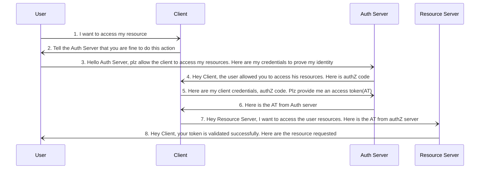

2, 3번 단계에서 Client가 Auth Server로 요청을 보낼 때, 엔드포인트는 다음을 포함해야 함
* client_id
* redirect_url
* scope
* state - CSRF 공격 방지를 위한 CSRF 토큰 
* response_type - 값이 `code`인 경우 authZ code 부여를 진행하겠다는 것을 뜻함

5번 단계에서 Client가 Auth Server로부터 auth code를 받은 후에 Client 다음 값들과 같이 토큰을 Auth Server에 요청함
* code - auth code
* client_id & client_secret - client의 credentail
* grant_type - 사용된 grant type의 종류. 이 경우에는 `authorization_code`.
* redirect_id

Okta가 OAuth 인수

Okta의 제품을 사용하면 쉽게 인증 서버 구축 가능

https://www.oauth.com/playground 에서 OAuth 2.0 프로세스 체험 가능

### Implicit Flow Grant Type
보안 상의 이유로 deprecated 되고 2.1 버전에서 삭제됨 -> 실무 사용 지양

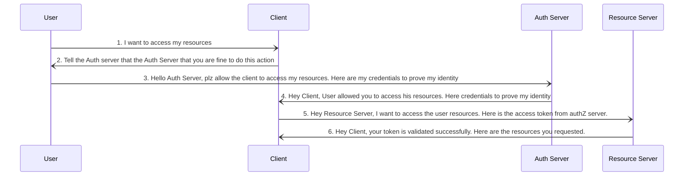

Implicit Flow에서는 auth code 거치지 않고 바로 access token 부여

아래 정보만 보내면 됨
* client_id
* redirect_url
* scope
* state
* response_type

* 문제점
  * client_id & client_secret을 검증하지 않기 때문에 누구나 client임을 흉내낼 수 있음
  * access token이 GET 요청으로 전송됨

### Password Grant/Resource Owner Credentials Grant Type
보안 상의 이유로 deprecated 되고 2.0 버전에서 삭제됨 -> 실무 사용 지양

써야 한다면 반드시 client, authorization server, resource server가 동일 조직이 관리하는 경우에만 사용할 것

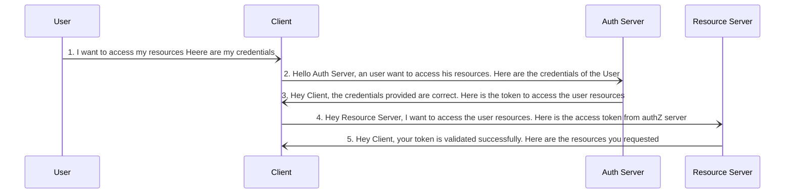

* 문제점
  * resource owner가 자신의 credentials를 공유해야 함

2번 단계에서 클라이언트가 Auth Server에 요청을 보낼 때, 엔드포인트가 다음의 정보를 보내야 함
* client_id & client_secret
* scope
* username & password
* grant_type

### Client Credentials Grant Type
end user(resource owner)가 참여하지 않고 2개의 애플리케이션이 서로 통신해야 할 때

A 조직 소속의 client와 B 조직 소속의 auth server와 resource server 사이에서만 데이터를 공유하고 싶을 때 사용

OAuth2에서 가장 간단한 grant type flow

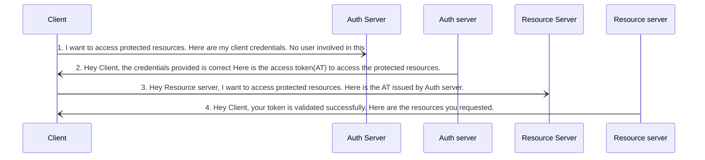

1번 단계에서 클라이언트가 Auth Server에 요청을 보낼 때, 엔드포인트가 다음의 정보를 보내야 함
* client_id & client_secret
* scope
* grant_type

### Refresh Token Grant Type Flow
access token(AT), refresh token(RT)을 발급

RT로 다른 grant type flow를 시작할 수 있음

RT가 유효하면 신선한 AT(새로운 만료 시간이 설정된 토큰) 발급

사용자에게 매번 로그인 하라고 할 필요없이 auth server가 발급한 RT를 사용하여 재인증 할 수 있음

access token이 영원히 만료되지 않도록 만들 수 있지만 권장되지 않음

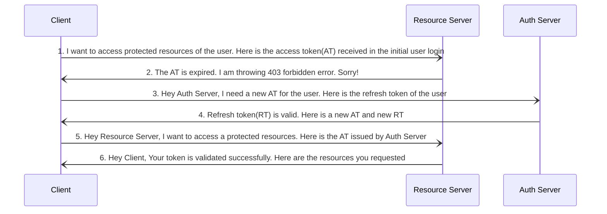

3번 단계에서 클라이언트가 Auth Server에 요청을 보낼 때, 엔드포인트가 다음의 정보를 보내야 함
* client_id & client secret
* refresh_token
* scope
* grant_type

### 인증서버의 토큰 검증 방법
1. authorization server와 resource server와 직접 API 통신
   - client의 요청이 있을 때마다 resource 서버가 authorization server에 요청해야 하므로 불필요한 트래픽 발생
2. authorization server와 resource가 동일한 DB 사용
3. resource server가 시작 시에 authorization server와 연결하고 공개 인증서를 받아와 공개키로 AT를 검증
   - resource server와 authorization server가 지속적으로 연결될 필요 없음
   - 가장 권장되는 방법이고 가장 자주 사용되는 방법

## OpenID Connect
OpenID Connect는 OAuth 2.0 프레임워크의 최상부에 위치한 프로토콜

OAuth 2.0이 scope를 가지는 access token으로 인증을 제공한다면, OpenID Conenct는 신원에 대한 정보(email, 주소 등 개인 정보)와 claim들을 포함한 새 ID 토큰을 도입함

OpenID Connect는 ID 토큰을 이용해 애플리케이션의 신원 정보 공유에 대한 표준을 제공함

OAuth와 OpenID Connect가 다른 점은 처음 요청에 openid의 특정 scope가 사용되고, 마지막 교환 시에 클라이언트가 액세스 토큰과 ID 토큰 두 가지를 받는다는 것

OAuth 프레임워크에서 OpenID connect가 authN, OAuth 2.0이 authZ를 담당

* OpenID Connect의 중요성
  * 모든 애플리케이션에서 신원은 중요함
  * OAuth 2.0은 현대적 인증의 핵심이지만 인증 컴포넌트가 부족함
  * OAuth 2.0의 최상단에 OpenID Connect를 구현함으로써 IAM(Identity Access Management) 전략이 완성됨
  * 더 많은 애플리케이션이 서로 연결되고 인터넷에 더 많은 신원들이 생성되면서 이 신원들을 공유하는 것에 대한 수요가 증가함
  * 애플리케이션들은 OpenID connect과 함께 신원을 쉽고 표준화된 방법으로 공유가 가능해짐

OIDC가 openid, profile, email, 주소를 표준화함

ID 토큰은 JWT를 사용

OIDC 표준은 "/userinfo" 엔드포인트에서 신원 정보를 조회할 수 있음


## OAuth 구현하기

```java
@Configuration
public class SpringSecurityOauth2GitHubConfig {
    @Bean
    SecurityFilterChain defaultSecurityFilterChain(HttpSecurity http) throws Exception {
        http.authorizeHttpRequests((requests)->requests.anyRequest().authenticated())
                .oauth2Login(Customizer.withDefaults());
        return http.build();
    }

    @Bean
    public ClientRegistrationRepository clientRepository() {
        return new InMemoryClientRegistrationRepository(clientRegistration());
    }

    private ClientRegistration clientRegistration() {
		return CommonOAuth2Provider.GITHUB.getBuilder("github").clientId("clientId")
	           .clientSecret("clientSecret").build();
	 }
}
```

form 로그인은 더 이상 사용하지 않고 oauth2 로그인 방식을 사용함

CommonOAuth2Provider에 설정된 주요 OAuth2 제공자들을 사용하여 ClientRegistration 객체를 생성하고 이를 바탕으로 ClientRegistrationRepository 빈을 등록한다.
* application.properties 또는 application.yml에서 설정도 가능


## Keycloak
OAuth 자체는 프로토콜일뿐 구현체를 제공하지 않음

구글, 페이스북, 깃허브는 자체적으로 authorization server를 가지고 있지만 대다수는 그렇지 않음

Keycloak, Okta, ForgeRock Amazon Cognito 등 authorization server 제품들이 있음

Keycloak은 오픈 소스, 무료이며 다운로드하여 쉽게 사용 가능. 안정적인 서비스와 다양한 기능 제공.

## Keycloak 인증 서버 사용하기
1. Keycloak 서버 다운로드 후 admin 계정 생성
2. 새 realm 생성

## Keycloak 인증서버 사용하여 OAuth2 애플리케이션 구현하기

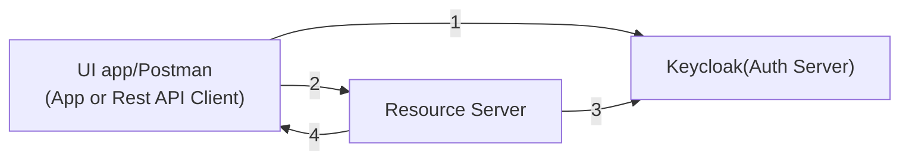

1. 클라이언트 앱이나 REST API 클라이언트가 리소스를 Resource Server에서 가져오려면 Keycloak에서 access token(AT)을 받아와야 함
2. 클라이언트 앱이 리소스에 접근하기 위해 가져온 AT로 Resource Server에 연결하여 
3. Resource Server는 AT의 유효성을 검증하기 위해 인증 서버(Keycloak)에 연결
4. AT가 유효하면, Resource Server는 클라이언트 앱에 리소스를 응답해줌

## PKCE(Proof Key for Code Exchange)
자바스크립트로는 클라이언트 비밀 정보를 감출 수 없음

따라서, grant type을 authoriztion code가 아니라 PKCE로 사용하여 해결

사용자가 로그인 버튼을 클릭하면 클라이언트 앱은 암호학적으로 랜덤한 `code_verifier`를 생성하고 이를 통해 `code_challenge`를 생성함

`code_challange`는 SHA-256 해시 값인 `code_verifier`의 Base64-URL-encoded 문자열이다.

`code_challenge`와 함께 사용자를 인증 서버로 리다이렉트 시킴

인증 서버는 `code_challenge`를 저장하고 사용자를 authorization code(1회성)와 함께 애플리케이션으로 다시 리다이렉트 시킴

클라이언트 앱은 authorization code와 `code_verifier`를 인증 서버로 보냄

인증 서버는 `code_challege`와 `code_verifier`를 검증하며 두 값이 유효할 경우 ID 토큰과 access token(추가적으로 refresh token)을 응답함

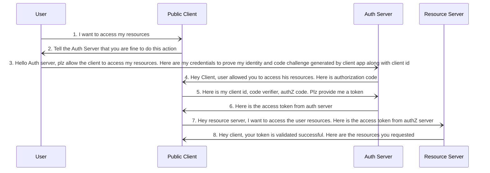

2, 3번 단계에서 클라이언트가 Auth Server에 요청을 보낼 때, 엔드포인트가 다음의 정보를 보내야 함
* client_id
* redirect_uri
* scope
* state
* response_type
* code_challenge
* code-challenge_method

5번 단계에서 Client가 Auth Server로부터 auth code를 받은 후에 Client 다음 값들과 같이 토큰을 Auth Server에 요청함
* code
* client_id & client_secret
* grant_type
* redirect_uri
* code_verifier

PKCE는 원래 모바일 앱, SPA, 자바스크립트 애플리케이션 내에서 사용하기 위해 만들어졌으나, 인증 코드 인젝션 공격이나 인증 코드 조작를 회피할 수 있어서 최근에는 클라이언트가 비밀 정보를 안전하게 저장할 수 있다고 하더라도 PKCE를 사용하도록 권장됨


## 기타 Keycloak 기능
로그인 페이지 변경 - Realm settings > Themes에서 수정도 가능
https://www.keycloak.org/docs/latest/server_development/index.html#_themes 참조

Admin REST API 목록
https://www.keycloak.org/docs-api/22.0.4/rest-api/index.html

scope 관리 - Client scope

인증 관련 설정 - authentication - 정책 설정도 가능(비밀번호 길이 등)

소셜 로그인 추가 시 Identity providers 이용 가능
Keycloak 이외의 저장소에 사용자 저장 - User federation: Kerberos providers, Ldap providers 설정 가능

소셜 로그인의 한계 - 소셜 로그인 사용하면 role을 할당할 수 없음


