# spring-security-study
spring security에 대해 공부한 내용을 정리합니다.

## 스프링 시큐리티를 쓰는 이유
* 증가하는 보안 위협에 대해 프레임워크 사용만으로 대응이 가능
  * 해커들은 항상 침입할 준비를 하고 있고 보안 취약점은 매일 같이 갱신됨
  * 따라서 보안 영역은 어렵고 힘든 부분일 수밖에 없음
  * 보안에 대한 걱정은 프레임워크에 맡기고 비즈니스 로직에 집중할 수 있음
  * 스프링 시큐리티는 여러 전문가들이 수많은 보안 시나리오에 대해 고민하며 만든 프로젝트
  * 새로운 취약점이 발견되면 여러 집단들이 수정해 나감
  * 스프링 시큐리티는 최소한의 설정만으로 보안을 향상할 수 있음

## 스프링 시큐리티 흐름

```mermaid
---
title: Spring Security Internal Flow
---
graph LR
    1[🖥 User Entered\nCredentials]-->|1|2[Spring Security\nFilters\n]
    2-->|2|3[Authentication]
    2-->|9|4[Spring context]
    2-->|3|5[Authentication Manager]
    5-->|4|6[Authentication Providers]
    6-->|5|7[UserDetailsManager, UserDetailsService]
    6-->|6|8[Password Encoder]
    6-->|7|5
    5-->|8|2
    2-->|10|1
```

## 스프링 시큐리티 필터
스프링 시큐리티에서는 요청과 응답을 가로채는 필터가 존재

약 20종 이상

* AuthorizationFilter - 공개 URL인 경우에만 통과
* DefaultLoginPageGeneratingFilter - 비공개 URL 접근시 기본 로그인 페이지 보여줌
* UsernamePasswordAuthenticationFilter - username과 password를 요청 서블릿에서 뽑아내는 역할
  * UsernamePasswordAuthenticationToken(Authentication 구현체) 생성해줌 
  * ProviderManager(AuthenticationManager의 구현체)에 인증 요청(authenticate() 메서드)
    * ProviderManager는 여러 AuthenticationProvider을 인증 성공할 때까지 순회 
  * DaoAuthenticationProvider(AbstractUserDetailsAuthenticationProvider의 구현체)
    * authenticate()가 인증 로직 수행
      * retrieveUser()가 사용자 정보 가져옴
      * retrieveUser()는 UserDetailsManager, UserDetailsService의 도움을 받음
      * 저장소에서 사용자 정보를 가져와야 할 때 UserDetailsManager, UserDetailsService을 사용
      * PasswordEncoder는 비밀번호를 암호화(해시)하는 데 사용
  * DaoAuthenticationProvider는 InMemoryUserDetailsManager(UserDetailsManager 구현체)를 사용하여 사용자 정보를 가져옴
    * `application.properties`에서 username과 password를 설정하면 in-memory에 로드됨
    * retreiveUser() 메서드가 로드된 username과 password를 바탕으로 UserDetails 객체를 생성해줌
    * 이 UserDetails를 additionalAuthenticationChecks() 메서드에게 전달하고 이 메서드는 기본 PasswordEncdoder를 사용하여 일치하는지 확인함